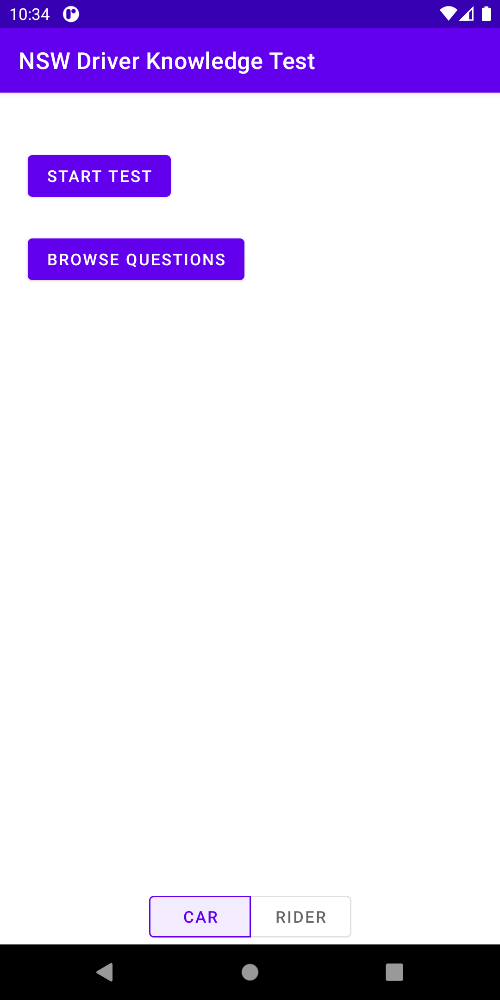
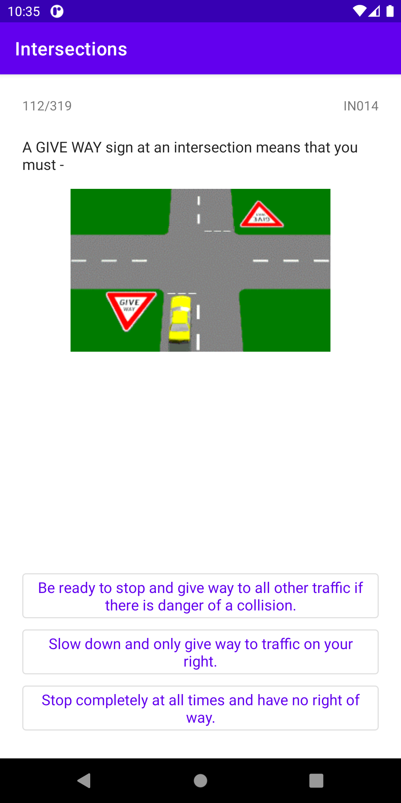
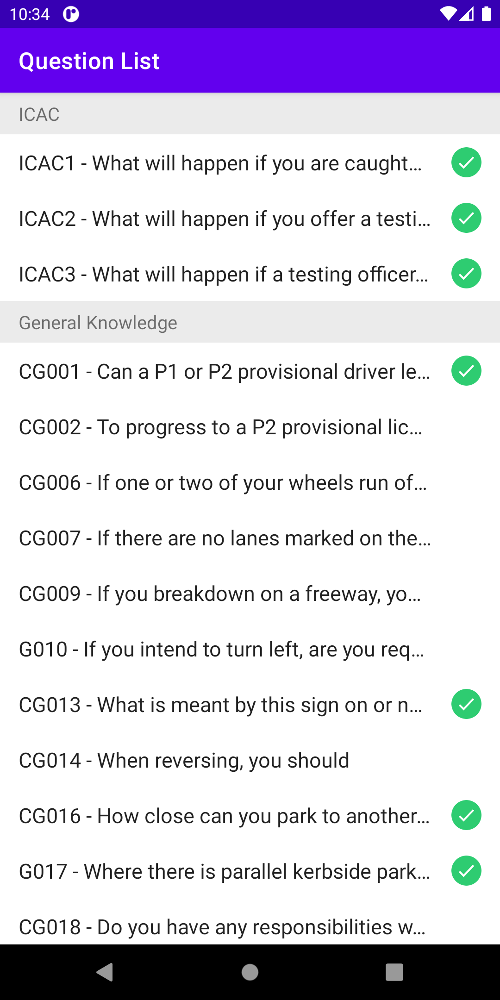

# Android Driver Knowledge Test (NSW) 

DKT NSW is an app for practicing the NSW Driver Knowledge test

  

## Features
  - Fast native Android app with material design
  - Both Car and Rider question  banks
  - Completely open source and free.

## Libraries utilised
  - Dagger2
  - RxJava
  - Room

## License
 * The application is released fully under GPLv3
 * This application is 100% Free with no ads!
 * The app uses the question banks published by the NSW Road Maritime Service published [here](https://www.rms.nsw.gov.au/roads/licence/driver/tests/driver-knowledge-test.html)

Credits:
  - Michael Johnston <michael.johnston29@gmail.com>

This is a third party app and is not affiliated at all with the NSW RMS.

